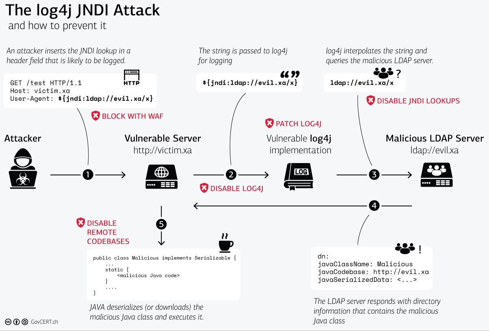

# Apache Log4j Zero Day aka Log4Shell aka LogJam aka CVE-2021-44228

<!-- vim-markdown-toc GFM -->

* [Introduction](#introduction)
* [Reproducing the problem in k8s env](#reproducing-the-problem-in-k8s-env)
	* [Setting up k8s env with the vulnerability](#setting-up-k8s-env-with-the-vulnerability)
* [Possible Solutions](#possible-solutions)
	* [KubeArmor Security {olicy](#kubearmor-security-olicy)
	* [Cilium Network Policy](#cilium-network-policy)
		* [Restricting access to RMI ports](#restricting-access-to-rmi-ports)
		* [Challenges associated with such rules](#challenges-associated-with-such-rules)
* [Preventing future Zero-Days](#preventing-future-zero-days)
	* [MITRE tactics](#mitre-tactics)

<!-- vim-markdown-toc -->

## Introduction

On December 9th, 2021, the world was made aware of a new vulnerability
identified as
[CVE-2021-44228](https://nvd.nist.gov/vuln/detail/CVE-2021-44228), affecting
the Apache Java logging package log4j. This vulnerability earned a severity
[score of
10.0](https://nvd.nist.gov/vuln-metrics/cvss/v3-calculator?name=CVE-2021-44228&vector=AV:N/AC:L/PR:N/UI:N/S:C/C:H/I:H/A:H&version=3.1&source=NIST)
(the most critical designation) and offers trivial remote code execution on
hosts engaging with software that utilizes this log4j version.  “Log4Shell" is
the name given to this assault.

Today, log4j version 2.15.0rc2 is available and patches this vulnerability.
However, the sheer danger of this vulnerability is due to how ubiquitous the
logging package is. Millions of applications as well as software providers use
this package as a dependency in their own code.

[Earliest detection known](https://twitter.com/eastdakota/status/1469800951351427073): 2021-12-01 04:36:50 UTC


**Affected Versions:**
* Log4j <= 2.14.1
* Apache: 2.0 <= Apache log4j <= 2.14.1

Who is affected?
* **Impact**: Arbitrary code execution as the user the parent process is running as (code fetched from the public Internet, or lolbins already present on system, or just fetching shared secrets or environment variables and returning them to the attacker).

* **Targets**: Servers and clients that run Java and also log anything using the log4j framework - primarily a server-side concern, but any vulnerable endpoint could be a target or a pivot point.

* **Downstream projects**: Until proven otherwise, assume anything that includes log4j - including Elasticsearch, Apache Struts / Solr / Druid / Flink, etc. - is affected in a way that requires mitigation.

* **Affected versions**: log4j 2.x confirmed - log4j 1.x only indirectly (previous information disclosure vulns) (in some [configurations](https://twitter.com/nluedtke1/status/1469435658389561345))

* **Appliances**: Don't forget appliances that may be using Java server components, but won't be detected by unauthenticated vulnerability scanning

* **Log forwarding**: Logging infrastructure often has many "northbound" (send my logs to someone) and "southbound" (receiving logs from someone) forwarding/relaying topologies. Chaining them together for exploitation must also be considered.

* **Cloud**: Multiple large providers also affected (A community-curated list of software and services vulnerable to CVE-2021-44228 can be found in [this GitHub repo](https://github.com/YfryTchsGD/Log4jAttackSurface).

## Reproducing the problem in k8s env



### Setting up k8s env with the vulnerability
todo

## Possible Solutions

todo

### KubeArmor Security {olicy

todo

### Cilium Network Policy

Cilium team has already come up with their
[analysis](https://isovalent.com/blog/post/2021-12-log4shell) for preventing
exploits for log4j in k8s env using network policies. Essentially, the
prevention policies aim at ensuring that the least permissive policies for DNS
are applied such that anything outside of that realm is forbidden.

One challenge for a security team in this context could be to figure out all
the possible FQDNs connected to by the pods. Cilium provides rich network
visibility using which one can possibly come up with the exhaustive set of
FQDNs accessed by the pods.

In addition to those policies there are few other preventive policies that
could be undertaken.

#### Restricting access to RMI ports

RMI is functionality least utilized by most of the organizations. In case of
log4j, the RMI is enabled by default and most organization might not care if it
is disabled altogether. So if your organization is not actively using that
feature, the best is to disable it altogether. Following Cilium policy could be put to use:

```yaml=
apiVersion: "cilium.io/v2"
kind: CiliumNetworkPolicy
metadata:
  name: "L4_rule_to_block_RMI_access"
spec:
  endpointSelector:
    matchLabels:
      app: log4j2
  ingress:
  - fromEndpoints:
    toPorts:
    - ports:
      - port: "1099"
        protocol: TCP
```
... where 1099 is the default RMI port.

#### Challenges associated with such rules

Usually such kind of rules are easy to be envisaged in hindsight.

todo

## Preventing future Zero-Days

todo

### MITRE tactics

todo
